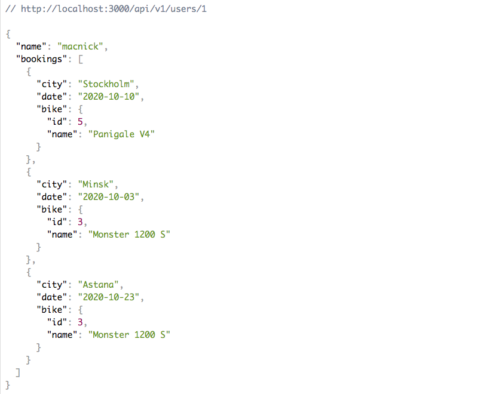

# BookADuc API

Select your favorite Ducati bike and book an appointment to take it for a test ride! This is Microverse's final capstone project!

## Table of Contents

- [About this project](#About)
- [Live Version](#Live-version)
- [Example Response](#Example-Response)
- [Technologies Used](#Technologies-Used)
- [Setup and Run](#Setup-and-Run-in-Your-Computer)
- [Author](#Author)
- [Show your support](#Show-your-support)
- [Acknowledgments](#Acknowledgments)

## About

This is the backend of the project. It is built with Ruby on Rails. You can use this [app](#link_to_front_end) to access it or build your own front-end.

The app uses 3 tables to save Users, Bikes, and Bookings. Authentication is implemented using JSON Web Token. Implemented versioning so new version can be created without breaking the old ones. Also implemented data serialization using the Active Model Serializer gem. The serializer allows returning all the related data in an organized format. Consequently, front-end apps do not have to make extra API requests to get the relevant data.

## Live version

A live version of the API is hosted on Heroku.

- [**BookADuc**](https://evening-cove-51744.herokuapp.com/) @ Heroku

The user has to create an account to get access to the API. The following endpoints are implemented:

### Signup

- POST: `https://bookaduc-api.heroku.com/signup`
- Parameters: `{name: string, email: string, password: string}`

### Login

- POST: `https://bookaduc-api.heroku.com/auth/login`
- Parameters: `{ email: string, password: string }`

### Get a list of bikes

- GET: `https://bookaduc-api.heroku.com/api/v1/bikes`
- Parameters: `{ Authorization: 'Bearer ${token}'`

### Get a specific bike

- GET: `https://bookaduc-api.heroku.com/api/v1/bikes/${id}`
- Parameters: `{ Authorization: 'Bearer ${token}'`

### Create a new booking

- GET: `https://bookaduc-api.heroku.com/api/v1/bookings/new`
- Parameters: `{ city: string, date: date, user_id: integer, }`
- Headers: `{ Authorization: 'Bearer ${token}'`

### Get user bookings

- GET: `https://bookaduc-api.heroku.com/api/v1/users/${id}`
- Parameters: `{ Authorization: 'Bearer ${token}'`

[Up](#Table-of-Contents)

## Example Response

Example JSON responce when getting list of bikes.

Example JSON response for current user

[Up](#Table-of-Contents)

## Technologies Used

- Ruby on Rails 6
- PostgreSQL

[Up](#Table-of-Contents)

## Setup and Run in Your Computer

Use your terminal and run the commands after each instruction.

| Command                                                 | Description                                      |
| ------------------------------------------------------- | ------------------------------------------------ |
| `git clone https://github.com/macnick/bookaduc-api.git` | Clone the repository to you computer             |
| `cd bookaduc-api`                                       | Navigate to the newly created folder             |
| `bundle install`                                        | Install gem dependencies                         |
| `rails db:create` followed by `rails db:migrate`        | Setup the database                               |
| `rails server`                                          | Starts the development server                    |
|                                                         | Press `Ctrl + c` to kill **http-server** process |
| `rails db:seed`                                         | Fill the db with the required Bike data          |
| `http://localhost:3000`                                 | Visit this link in your browser to use it        |

[Up](#Table-of-Contents)

## 👤 Author

## Nick Haralampopoulos

- Github: [@macnick](https://github.com/macnick)
- Twitter: [@mac_experts](https://twitter.com/mac_experts)
- Linkedin: [Nick Haralampopoulos](https://www.linkedin.com/in/nick-haralampopoulos/)
- AngelList: [Nick Haralampopoulos](https://angel.co/u/nick-haralampopoulos)

## Show your support

Give a ⭐️ if you enjoyed this project!

## Acknowledgements

- [Microverse](https://www.microverse.org) software development school
- [Article](https://www.digitalocean.com/community/tutorials/build-a-restful-json-api-with-rails-5-part-one) used for learning API authorization

[Up](#Table-of-Contents)

## 📝 License

This project is [MIT](lic.url) licensed.
